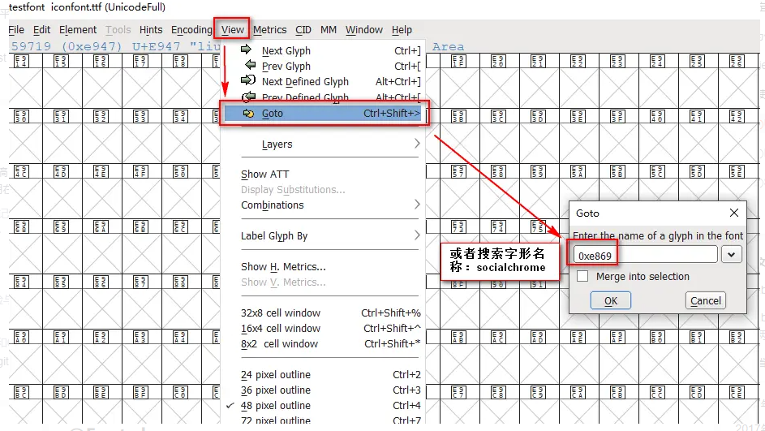

## iconfont原理
### 从iconfont.css出发

#### 字体定义

打开iconfont.css，可以看到第一行有一个 @font-face 声明，其中font-family属性定义了这个字体的名称，src属性定义了该要渲染字体需要下载的字体文件。

- 为什么有两个src？<br>
  绝大多数情况下，第一个 src 是可以去掉的，除非需要支持 IE9 下的兼容模式。在 IE9 中可以使用 IE7 和 IE8 的模式渲染页面，微软修改了在兼容模式下的 CSS 解析器，导致使用 ? 的方案失效。由于 CSS 解释器是从下往上解析的，所以在上面添加一个不带问号的 src 属性便可以解决此问题。
- #iefix有何作用？<br>
  IE9 之前的版本没有按照标准解析字体声明，当 src 属性包含多个 url 时，它无法正确的解析而返回 404 错误，而其他浏览器会自动采用自己适用的 url。因此把仅 IE9 之前支持的 EOT 格式放在第一位，然后在 url 后加上 ?，这样 IE9 之前的版本会把问号之后的内容当作 url 的参数。至于 #iefix 的作用，一是起到了注释的作用，二是可以将 url 参数变为锚点，减少发送给服务器的字符。<br>

至于后面的src和一堆url主要是为了兼容不同的浏览器，format属性告诉浏览器这个字体的格式，可选的字体格式有 woff、woff2、truetype、opentype、embedded-opentype、svg。

#### 字体使用
阿里提供了Unicode、Font class、Symbol三种引用方式。<br>
1. Unicode
   ```html
   <span class="icon iconfont">&#xe78a;</span>
   ```
   ```css
    .iconfont {
        font-family: 'iconfont' !important;
        font-size: 16px;
        font-style: normal;
        -webkit-font-smoothing: antialiased;
        -moz-osx-font-smoothing: grayscale;
    }
   ```
   为什么html中使用unicode编码是&#x[e0-9]*;这样的形式呢？
   
   这是html中字符的数字表示法，另还有实体表示法（如空格使用&nbsp;表示），详情可查看<a href="https://www.wangdoc.com/html/encode.html">HTML 字符编码</a>。

   那么我们如何才能知道我们字体文件中每个字形对应的是哪个unicode码呢？我们可以直接从下载的demo_unicode.html文件中找到该图标对应的16进制数。如果你想对这个图形做一些修改，可以用fontForge打开字体文件，接着根据16进制数或者图标名字来定位到该图标：

   

   当在你在FontForge中修改了字形后，点击File->Generate Fonts.. 生成字体文件（记住每种格式导出一份），然后在font-face中修改文件的引用地址即可。
2. Font class
   这种引入方式和原理与unicode类似
   ```html
   <span class="icon iconfont iconxian83"></span>
   ```
   ```css
   .iconfont {
        font-family: 'iconfont' !important;
        font-size: 16px;
        font-style: normal;
        -webkit-font-smoothing: antialiased;
        -moz-osx-font-smoothing: grayscale;
    }
   .iconxian83:before {
        content: '\e6f3';
    }
   ```

   这种方式只是在原来的dom上增加一个伪元素，css中正斜杠\表示一个16进制数字。这样写的好处是可以直接通过审查dom元素就知道它引用的是哪个字形，看起来更加语义化。
3. Symbol
   
   iconfont事实上使用的是使用系统字体渲染引擎，而它是只支持单色的。官网称Symbol可以实现多色，如何做到的呢？以下是官网对其的描述：
   >这是一种全新的使用方式，应该说这才是未来的主流，也是平台目前推荐的用法。相关介绍可以参考这篇文章 这种用法其实是做了一个svg的集合，与另外两种相比具有如下特点：<br>
    >1. 支持多色图标了，不再受单色限制。
    >2. 通过一些技巧，支持像字体那样，通过font-size,color来调整样式。
    >3. 兼容性较差，支持 ie9+,及现代浏览器。
    >4. 浏览器渲染svg的性能一般，还不如png。

我们重新来看一下下载的文件，发现里面并没有svg文件，而是多了一个iconfont.js，然后看了一下我们的html文件中引入svg的方式都是：
```html
    <svg class="icon svg-icon" aria-hidden="true">
      <use xlink:href="#iconxian10"></use>
    </svg>
```
了解svg的童鞋应该知道这是SVG Sprite的写法，所以使用了js文件将svg嵌入了文档中而不是单独拿出来，因为SVG Sprite只能在同一个文档中使用svg的symbol。可能有些童鞋又疑惑了，svg的大小不是不支持font-size修改的吗？如何实现的呢？其实这里用了一个比较hack的方式，就是把图标元素的宽高都写为1em，而em的大小是相对于该元素的字体大小的，这样就实现了svg宽高跟着svg的字体大小一起变了。
<a href="https://www.zhangxinxu.com/wordpress/2014/07/introduce-svg-sprite-technology/">SVG Sprite技术介绍</a>
<a href="https://www.cnblogs.com/10manongit/p/12639013.html">SVG Sprite 入门（SVG图标解决方案）</a>

#### 深入：字体文件怎么渲染

如果你是win10或win8用户，打开操作系统的字体文件目录：C:\Windows\Fonts\或C:\Winnt\Fonts，点击左侧的“查找字符”：可以看到一个字符矩阵。字体文件是一个以unicode为索引的字形表，每个字形都是一个矢量图。浏览器在遇到unicode编码时就去查找系统字形表（如果有自定义的字体，会在自定义字体中查找），找到对应字形进行渲染。

这样的机制会引出一个问题，我们能查找到对应的字符，必然时一个萝卜一个坑，一个编码对应一个字符，如果引入的iconfont字形编码跟系统原有的编码冲突了怎么办？unicode编码设计时已经考虑过这个问题，预留了E000 至 F8FF作为用户造字区（位于特别用途补充平面），原本是空的，用户可以在字体文件里面随便定义这些字符的形状。这样就不会出现冲突的情况了。（当然如果你引入了多个自定义字体，自定义字体间是有可能冲突的）
