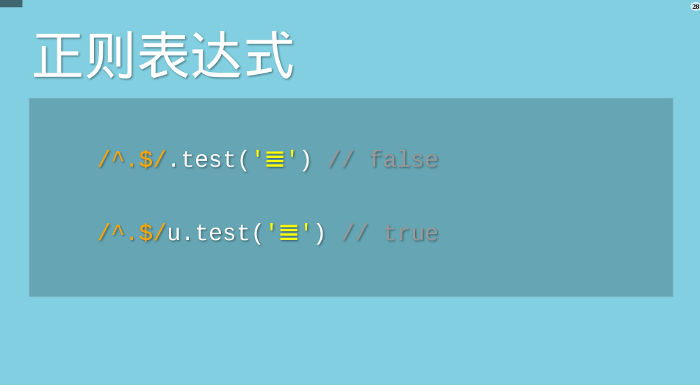

- <a href="https://zhuanlan.zhihu.com/p/386511092" target="_blank">JS的字符串编码</a>
- <a href="https://es6.ruanyifeng.com/#docs/string">ES6加强了对unicode编码的支持</a>
- <a href="http://www.ruanyifeng.com/blog/2014/12/unicode.html">Unicode与JavaScript详解</a>

### JavaScript字符函数的局限

由于JavaScript只能处理UCS-2编码，造成所有字符在这门语言中都是2个字节，如果是4个字节的字符，会当作两个双字节的字符处理。JavaScript的字符函数都受到这一点的影响，无法返回正确结果。
还是以字符为例，它的UTF-16编码是4个字节的0xD834 DF06。问题就来了，4个字节的编码不属于UCS-2，JavaScript不认识，只会把它看作单独的两个字符U+D834和U+DF06。前面说过，这两个码点是空的，所以JavaScript会认为是两个空字符组成的字符串！


上面代码表示，JavaScript认为字符的长度是2，取到的第一个字符是空字符，取到的第一个字符的码点是0xDB34。这些结果都不正确！

解决这个问题，必须对码点做一个判断，然后手动调整。下面是正确的遍历字符串的写法。

```js
while (++index < length) {
  // ...
  if (charCode >= 0xD800 && charCode <= 0xDBFF) {
    output.push(character + string.charAt(++index));
  } else {
    output.push(character);
  }
}
```
上面代码表示，遍历字符串的时候，必须对码点做一个判断，只要落在0xD800到0xDBFF的区间，就要连同后面2个字节一起读取。

类似的问题存在于所有的JavaScript字符操作函数。
```js
String.prototype.replace();
String.prototype.substring();
String.prototype.slice();
// ...
```
上面的函数都只对2字节的码点有效。要正确处理4字节的码点，就必须逐一部署自己的版本，判断一下当前字符的码点范围。

### ES6增强了对Unicode的支持

1. 正确识别字符
   ES6可以自动识别4字节的码点。因此，遍历字符串就简单多了。
   ```js
   for (let s of string ) {
    // ...
    }
   ```
   但是，为了保持兼容，length属性还是原来的行为方式。为了得到字符串的正确长度，可以用下面的方式。
2. 码点表示法
   JavaScript允许直接用码点表示Unicode字符，写法是"反斜杠+u+码点"。
   ```js
   '好' === '\u597D' // true
   ```
   但是，这种表示法对4字节的码点无效。ES6修正了这个问题，只要将码点放在大括号内，就能正确识别。
   
3. 字符串处理函数
   ES6新增了几个专门处理4字节码点的函数。
   ```js
   String.fromCodePoint(); // 从Unicode码点返回对应字符
   String.prototype.codePointAt(); // 从字符返回对应的码点
   String.prototype.at(); // 返回字符串给定位置的字符
   ```
4. 正则表达式
   ES6提供了u修饰符，对正则表达式添加4字节码点的支持。
   
5. Unicode正规化
   
   有些字符除了字母以外，还有附加符号。比如，汉语拼音的Ǒ，字母上面的声调就是附加符号。对于许多欧洲语言来说，声调符号是非常重要的。

   Unicode提供了两种表示方法。一种是带附加符号的单个字符，即一个码点表示一个字符，比如Ǒ的码点是U+01D1；另一种是将附加符号单独作为一个码点，与主体字符复合显示，即两个码点表示一个字符，比如Ǒ可以写成O（U+004F） + ˇ（U+030C）。
   ```js
     // 方法一
     '\u01D1'
     // 'Ǒ'

     // 方法二
     '\u004F\u030C'
     // 'Ǒ'
   ```
   这两种表示方法，视觉和语义都完全一样，理应作为等同情况处理。但是，JavaScript无法辨别。
   ```js
   '\u01D1'==='\u004F\u030C';  // false
   ```

   ES6提供了normalize方法，允许"Unicode正规化"，即将两种方法转为同样的序列。
   ```js
   '\u01D1'.normalize() === '\u004F\u030C'.normalize() 
    // true
   ```