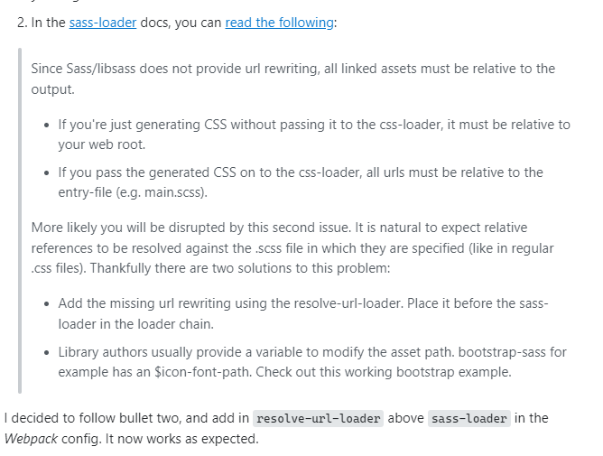

<a href="https://stackoverflow.com/questions/52219401/webpack-style-loader-css-loader-url-path-resolution-not-working">Webpack style-loader / css-loader: url() path resolution not working</a>
<a href="https://github.com/webpack-contrib/sass-loader#problems-with-url">sass-loader#problems-with-url</a>

